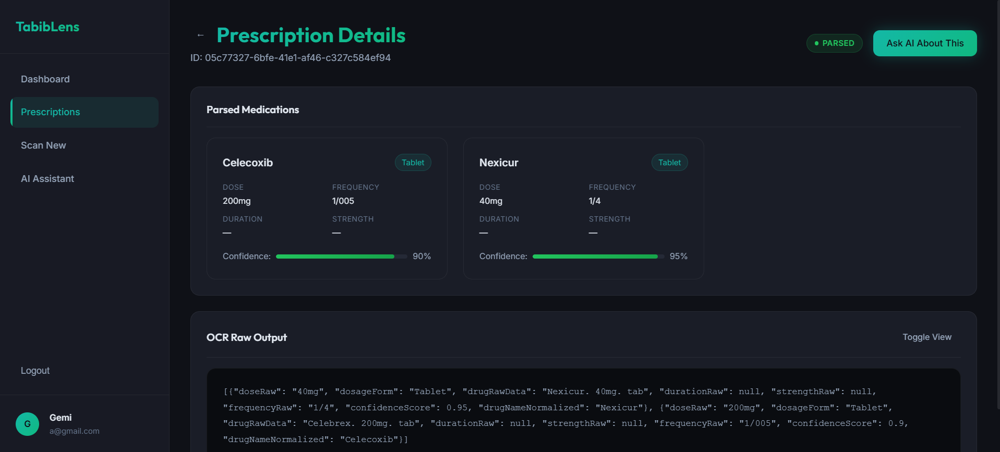
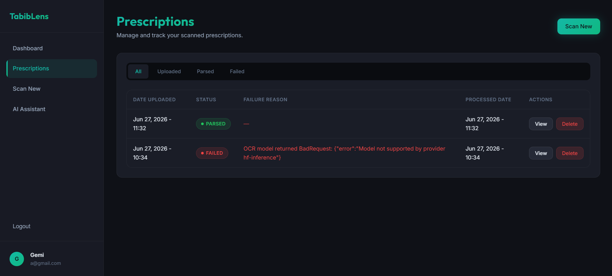
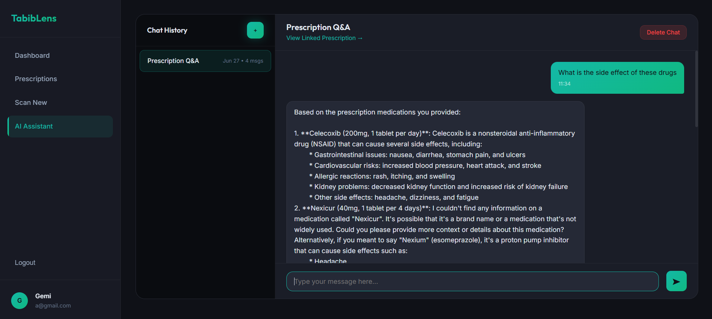

# TabibLens

An AI-powered **.NET 8 Web API** for scanning handwritten prescriptions via OCR, extracting medications, and providing an AI chat assistant for pharmaceutical Q&A.

## Screenshots

### Dashboard


### Prescription Processing


### AI Pharmaceutical Assistant



## Architecture

Clean Architecture with 4 backend layers, plus a frontend web application:

```
┌─────────────────────────────────────────────────────────┐
│  Web Layer (Razor Pages Frontend App)                   │
└───────────────────────────┬─────────────────────────────┘
                            │ (HTTP/JSON Calls)
                            ▼
┌─────────────────────────────────────────────────────────┐
│  API Layer (Controllers, Program.cs, Config)            │
├─────────────────────────────────────────────────────────┤
│  Application Layer (Services, DTOs)                     │
├─────────────────────────────────────────────────────────┤
│  Infrastructure Layer (Repositories, DbContext, APIs)   │
├─────────────────────────────────────────────────────────┤
│  Domain Layer (Entities, Enums, Interfaces)             │
└─────────────────────────────────────────────────────────┘
```

## Design Patterns

### Architectural Patterns
*   **Clean Architecture (Onion Architecture)**: The codebase is divided into isolated layers (`Domain`, `Application`, `Infra`, `Api/Web`). Core business logic is contained entirely inside the domain, and dependencies flow strictly inward, ensuring database and API framework details do not leak into the business logic.
*   **Decoupled Client-Server Layout**: The Razor Pages application (`TabibLens.Web`) is isolated from the backend API (`TabibLens.Api`), communicating strictly via REST endpoints.

### Design Patterns
*   **Repository Pattern**: Encapsulates database query and write operations behind abstractions (`IRepository<T>` and custom entity repositories). This abstracts Entity Framework Core, making the application easier to unit test.
*   **Unit of Work Pattern**: Combines database operations across multiple repositories into a single atomic transaction. Implemented via EF Core's `SaveChangesAsync` on the `AppDbContext`.
*   **Strategy Pattern (Service Abstraction)**: External dependencies like Hugging Face (OCR) and Groq (AI Chat) are accessed through interfaces (`IOcrService` and `IChatAiService`). This lets you swap LLM providers without rewriting core services.
*   **Dependency Injection (DI)**: Utilized to resolve and inject services, repositories, options, and db contexts, reducing tight coupling throughout the code.
*   **Options Pattern**: Binds configuration sections from `appsettings.json` to strongly-typed configuration objects (like `HuggingFaceOptions` and `JwtSettings`).
*   **Data Transfer Object (DTO) Pattern**: Custom schemas (e.g., `LoginDto`, `PrescriptionDto`) act as data transfer envelopes, preventing database entities from leaking into presentation layers.
*   **Soft Delete Pattern**: Entities tracking state inherit from `BaseEntity` with `IsDeleted` and `DeletedAt` fields. The database repository interceptor and EF Core queries handle soft deletion automatically.
*   **Global Exception Handling**: Custom middleware intercepts unhandled exceptions globally, standardizing JSON error outputs and HTTP status codes.
*   **JWT & Refresh Token Rotation**: A stateless security pattern leveraging short-lived access tokens alongside revolving, database-stored refresh tokens to protect session validity.


### Domain Layer (`Domain/`)

Core business entities and interfaces — **zero dependencies**.

| Entities | Enums | Interfaces |
|---|---|---|
| `User` | `PrescriptionStatus` | `IRepository<T>` (base CRUD) |
| `RefreshToken` | `DosageForm` | `IUserRepository` |
| `Prescription` | `MessageRole` | `IPrescriptionRepository` |
| `Medication` | | `IRefreshTokenRepository` |
| `ChatSession` | | `IChatSessionRepository` |
| `ChatMessage` | | `IChatMessageRepository` |
| `BaseEntity` (abstract) | | `IMedicationRepository` |
| | | `IUnitOfWork` |
| | | `IOcrService` |
| | | `IChatAiService` |

All entities inherit from `BaseEntity` (`Id`, `CreatedAt`, `UpdatedAt`, `IsDeleted`, `DeletedAt`).

### Infrastructure Layer (`Infra/`)

| Component | Description |
|---|---|
| `AppDbContext` | EF Core context (PostgreSQL), implements `IUnitOfWork`, auto-sets `CreatedAt`/`UpdatedAt` |
| `RepositoryBase<T>` | Generic CRUD with soft-delete support |
| 6 Repositories | `UserRepository`, `PrescriptionRepository`, `RefreshTokenRepository`, `ChatSessionRepository`, `ChatMessageRepository`, `MedicationRepository` |
| `QwenOcrService` | HuggingFace Qwen2.5-VL-7B for prescription image OCR |
| `GroqChatService` | Groq LLaMA 3.3 70B for pharmaceutical AI chat |

### Application Layer (`Application/`)

| Services | Description |
|---|---|
| `AuthService` | JWT login/register, BCrypt password hashing, refresh token rotation |
| `ChatService` | AI chat sessions with prescription-aware context |
| `PrescriptionService` | OCR scanning, medication parsing, status management |

**17 DTOs**: `LoginDto`, `RegisterDto`, `AuthResponseDto`, `UserDto`, `JwtSettings`, `CreateSessionRequestDto`, `ChatRequestDto`, `ChatResponseDto`, `ChatSessionDto`, `ChatMessageDto`, `OcrRequestDto`, `OcrResultDto`, `PrescriptionDto`, `PrescriptionSummaryDto`, `PrescriptionWithMedicationsDto`, `UpdateStatusRequestDto`, `MedicationDto`

### API Layer (`TabibLens.Api/`)

| Controller | Endpoints | Auth |
|---|---|---|
| `AuthController` | `POST /api/auth/login`, `POST /api/auth/register`, `POST /api/auth/logout` | Login/Register public; Logout requires JWT |
| `ChatController` | `POST /api/chat/sessions`, `GET /api/chat/sessions`, `GET /api/chat/sessions/{id}/messages`, `POST /api/chat/sessions/{id}/messages`, `DELETE /api/chat/sessions/{id}` | All require JWT |
| `PrescriptionController` | `POST /api/prescription/scan`, `GET /api/prescription`, `GET /api/prescription/{id}`, `GET /api/prescription/{id}/medications`, `GET /api/prescription/status/{status}`, `GET /api/prescription/{id}/result`, `POST /api/prescription/{id}/parse`, `PATCH /api/prescription/{id}/status`, `DELETE /api/prescription/{id}` | All require JWT |

---

## Tech Stack

| Technology | Purpose |
|---|---|
| .NET 8 | Web API framework |
| PostgreSQL | Database |
| Entity Framework Core | ORM |
| BCrypt.Net | Password hashing |
| JWT Bearer | Authentication |
| HuggingFace API | Prescription OCR (Qwen2.5-VL-7B) |
| Groq API | Pharmaceutical AI Chat (LLaMA 3.3 70B) |
| Swagger | API documentation |

---

## Getting Started

### Prerequisites

- [.NET 8 SDK](https://dotnet.microsoft.com/download/dotnet/8.0)
- [PostgreSQL](https://www.postgresql.org/download/)

### Configuration

1. Edit the API configuration at `TabibLens.Api/appsettings.json`:

```json
{
  "ConnectionStrings": {
    "DefaultConnection": "CONNECTION_STRING"
  },
  "JwtSettings": {
    "SecretKey": "SECRET_KEY_AT_LEAST_32_CHARS",
    "Issuer": "TabibLens",
    "Audience": "TabibLens-Client",
    "AccessTokenExpiryMinutes": 15,
    "RefreshTokenExpiryDays": 7
  },
  "HuggingFace": {
    "ApiKey": "HUGGINGFACE_API_KEY",
    "ModelId": "Qwen/Qwen2.5-VL-7B-Instruct:novita"
  },
  "Groq": {
    "ApiKey": "GROQ_API_KEY",
    "Model": "llama-3.3-70b-versatile",
    "Temperature": 0.7,
    "MaxTokens": 1024
  }
}
```

2. Edit the Web Frontend configuration at `TabibLens.Web/appsettings.json`:

```json
{
  "ApiSettings": {
    "BaseUrl": "http://localhost:5081"
  }
}
```

### Run

#### Option 1: Running Locally (Bare Metal)

```bash
# Restore packages
dotnet restore

# Apply migrations (create database)
dotnet ef database update --project Infra --startup-project TabibLens.Api

# Run the backend API
dotnet run --project TabibLens.Api

# Run the Razor Pages Web Frontend (in a separate terminal)
dotnet run --project TabibLens.Web
```

The API will be available at `http://localhost:5081` (or HTTPS at `https://localhost:7174`) with Swagger UI at `/swagger`.
The Web Frontend will be available at `http://localhost:5100` (or HTTPS at `https://localhost:7200`).

#### Option 2: Running with Docker Compose

Ensure Docker Desktop is running, then execute the following command in the repository root:

```bash
docker compose up --build
```

This will automatically build and start:
1. **PostgreSQL Database**: Accessible at `localhost:5432` (Username: `postgres`, Password: `1234`).
2. **Backend API**: Accessible at `http://localhost:5081` (with Swagger UI at `http://localhost:5081/swagger`).
3. **Web Frontend**: Accessible at `http://localhost:5100`.

*Note: Database migrations are automatically applied on startup by the API container as soon as the Postgres database is healthy and ready.*

---

## Authentication Flow

```
┌──────────┐     POST /api/auth/register      ┌──────────┐
│  Client  │ ──────── or ────────────────────► │   API    │
│          │     POST /api/auth/login          │          │
│          │ ◄──────────────────────────────── │          │
│          │   Body: { UserDto + AccessToken } │          │
│          │   Cookie: refreshToken (HttpOnly) │          │
│          │                                   │          │
│          │     Authorization: Bearer <JWT>    │          │
│          │ ─────────────────────────────────► │          │
│          │   (All protected endpoints)       │          │
└──────────┘                                   └──────────┘
```

- **Access Token**: Short-lived JWT (15 min) sent in response body
- **Refresh Token**: Long-lived (7 days), SHA256-hashed in DB, sent as HTTP-only secure cookie
- **Passwords**: BCrypt-hashed with work factor 12

---

## Prescription Processing Pipeline

```
┌───────────┐    ┌─────────────┐    ┌──────────────┐    ┌──────────────┐
│  Upload   │ ─► │  OCR Scan   │ ─► │  Parse JSON  │ ─► │  Store Meds  │
│  Image    │    │ (HuggingFace)│    │  Medications │    │  in DB       │
└───────────┘    └─────────────┘    └──────────────┘    └──────────────┘
     │                                                         │
     └── Status: Uploaded ──► OcrProcessing ──► Parsed/Failed ─┘
```

1. User uploads a prescription image via `POST /api/prescription/scan`
2. Image is sent to HuggingFace Qwen2.5-VL for OCR
3. OCR returns a JSON array of extracted medications
4. Medications are parsed and stored in the database
5. Prescription status transitions: `Uploaded → OcrProcessing → Parsed/PartiallyParsed/Failed`

---

## AI Chat

Chat sessions can optionally be linked to a prescription. When linked, the AI assistant receives medication context to provide prescription-aware answers about drug interactions, side effects, and usage instructions.

The pharmaceutical assistant:
- Answers in the language of the user's message (Arabic/English)
- Provides evidence-based medication information
- Always advises consulting a healthcare professional

---

## Project Structure

```
TabibLens/
├── Domain/
│   ├── Entities/              # User, Prescription, Medication, ChatSession, etc.
│   │   └── Abstractions/      # BaseEntity
│   ├── Enums/                 # PrescriptionStatus, DosageForm, MessageRole
│   ├── Interfaces/            # IOcrService, IChatAiService
│   └── Repository Interfaces/ # IRepository<T>, IUserRepository, etc.
│
├── Application/
│   ├── DTOs/                  # Request/response models (17 DTOs)
│   └── Services/
│       ├── Abstraction/       # IAuthService, IChatService, IPrescriptionService
│       └── Implementation/    # AuthService, ChatService, PrescriptionService
│
├── Infra/
│   ├── Data/                  # AppDbContext + EF Configurations
│   ├── Repositories/          # Repository implementations
│   └── ExternalApis/          # HuggingFace (OCR) + Groq (Chat AI)
│
├── TabibLens.Api/             # API entry point
│   ├── Controllers/           # Auth, Chat, Prescription, BaseApiController
│   ├── Middleware/            # ExceptionHandlingMiddleware
│   ├── Program.cs             # DI, middleware, JWT config
│   └── appsettings.json       # Configuration
│
├── TabibLens.Web/             # Razor Pages frontend application
│   ├── Pages/                 # Razor Pages (Auth, Chat, Prescriptions, Shared, Dashboard, Index, Error)
│   ├── Services/              # ApiService for communicating with the backend API
│   ├── wwwroot/               # Static assets (CSS, JS, images)
│   ├── Program.cs             # Frontend routing and configuration
│   └── appsettings.json       # Frontend settings (API base URL)
├── docker-compose.yml         # Docker Compose orchestration config
└── screenshots/               # Folder containing application UI screenshots
```
